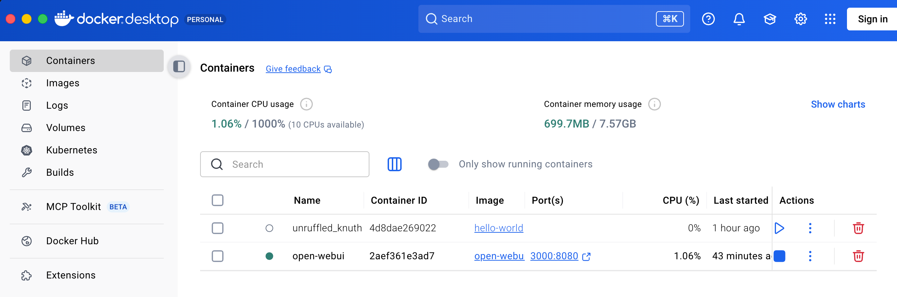
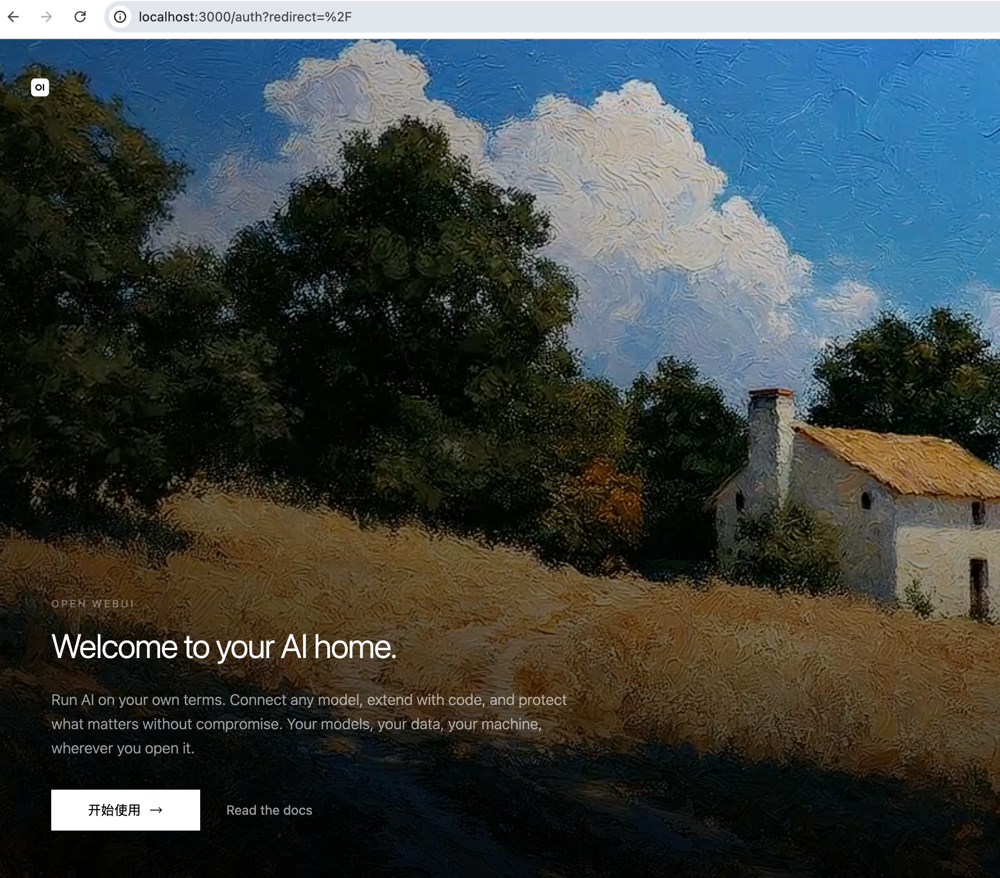

## Mac OS Ollama 安装部署 - 本地实操

### 直接官网下载安装包

[安装包下载](https://ollama.com/download/Ollama-darwin.zip)

## 快速入门

要运行并与 [DeepSeek-R1-1.5B](https://ollama.com/library/deepseek-r1) 进行对话：

```bash
ollama run deepseek-r1:1.5b
```

### REST API

Ollama 提供 REST API 来运行和管理模型。

#### 生成响应

```bash
curl http://localhost:11434/api/generate -d '{
  "model": "deepseek-r1:1.5b",
  "prompt":"为什么天空是蓝色的？"
}'
```

#### 与模型对话

```bash
curl http://localhost:11434/api/chat -d '{
  "model": "deepseek-r1:1.5b",
  "messages": [
    { "role": "user", "content": "为什么天空是蓝色的？" }
  ]
}'
```
---

## Mac OS Docker 安装

### 直接官网下载安装包

[安装包下载](https://www.docker.com/products/docker-desktop)

双击 Docker.dmg，把 Docker 拖入「应用程序」
打开 Docker.app，授予文件、网络、辅助功能权限，等待app左下 Engine running

### 终端验证安装

```bash
docker --version
```
输出版本号表示安装成功
```bash
Docker version 29.6.1, build 8900f1d
```

### 终端启动 container 示例

```bash
docker run hello-world
```
输出如下表示成功：
```bash
Unable to find image 'hello-world:latest' locally
latest: Pulling from library/hello-world
58dee6a49ef1: Pull complete 
c3bdf82c34d1: Download complete 
Digest: sha256:c3cbe1cc1aa588a64951ac6286e0df7b27fe2e6324b1001c619bb358770c0178
Status: Downloaded newer image for hello-world:latest

Hello from Docker!
This message shows that your installation appears to be working correctly.
......
```
此时，在 Docker App 主页可以看到创建的容器


## Open WebUI 启动

### 在 Mac OS CPU 运行，使用 Docker 一键启动 Open WebUI

```bash
docker run -d -p 3000:8080 \
--add-host=host.docker.internal:host-gateway \
-v open-webui:/app/backend/data \
--name open-webui \
--restart always \
-e OLLAMA_API_BASE_URL=http://host.docker.internal:11434 \
ghcr.io/open-webui/open-webui:main
```

输出如下表示成功：
```bash
Unable to find image 'ghcr.io/open-webui/open-webui:main' locally
main: Pulling from open-webui/open-webui
0c51ed9685cf: Pull complete 
......
9dc5c23e6cb6: Download complete 
759215a44482: Download complete 
Digest: sha256:***d7c3d
Status: Downloaded newer image for ghcr.io/open-webui/open-webui:main
2aef361e***bee6bef
```

这就代表使用 Docker 启动 Open WebUI 成功了。

### 初始化 Open WebUI

浏览器打开：http://localhost:3000

显示 Open WebUI 主页


### 重启/停止 Open WebUI
```bash
docker stop open-webui

docker restart open-webui
```
也可在 Docker App container 界面中操作。


