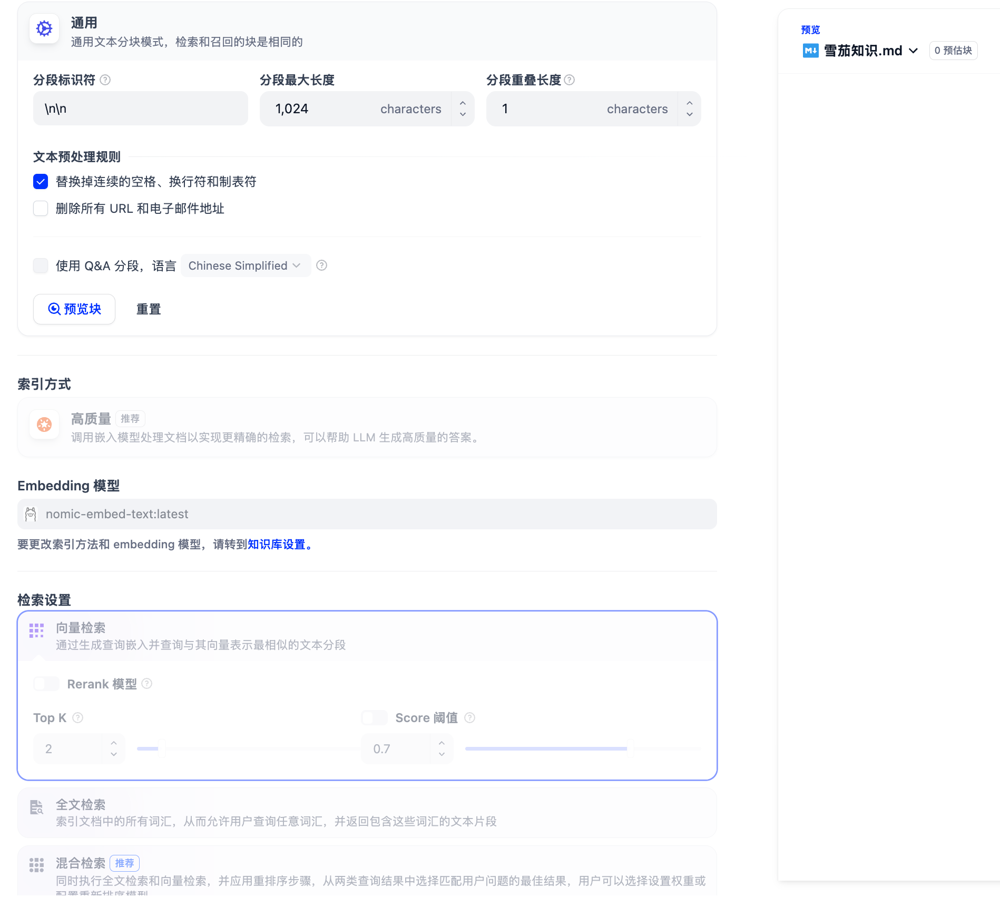
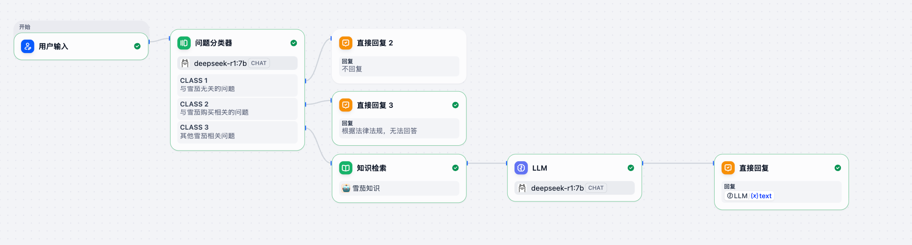
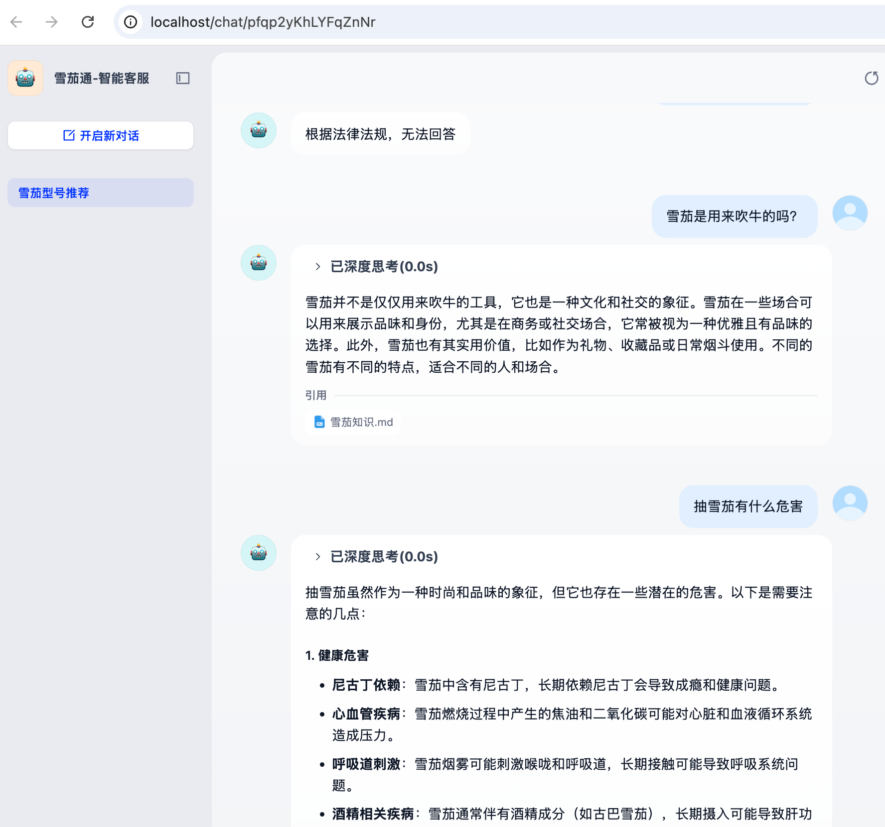

# Dify 本地跑通实操

## 关于下载
cloud.ai 需要 vpn 才能访问，改为本地部署启动。
尝试了很多 git clone 和 下载 zip 文件的方式，包括各种代理，都不能下载下来。
要么因为文件太大下载一半 fail，要么连不上。

### dify 可行下载方案 - GitCode 镜像
 [官文](https://docs.dify.ai/zh/self-host/deploy/quick-start/docker-compose)

``` bash
git clone --depth 1 https://gitcode.com/langgenius/dify.git
```

dify 只有 cloud 开发模式才有 sandbox 计划，本地没有，故模型使用本地 ollama 部署模型，

#### 运行
```bash
cd dify/docker
docker compose up -d
```

访问 http://localhost

### 下载 embedding 模型
dify 知识库要使用的 embedding 模型。
```bash
ollama pull nomic-embed-text
```

## 集成-模型供应商安装模型

先安装 ollama 供应商，再分别添加如下两个模型。

### 添加 deepseek 模型
配置项	填写值（Mac Docker）

模型名称	deepseek-r1:7b（从 ollama list 原样复制）

模型类型	LLM

基础 URL	http://host.docker.internal:11434

模型类型 (对话模式)	对话

模型上下文长度	8192（按模型实际，不确定填 4096）

最大 token 上限	8192

是否支持 Vision	否（llava/flux 选是）

### 添加 embedding 模型
模型名称：nomic-embed-text

模型类型：Text Embedding

基础 URL：http://host.docker.internal:11434

上下文长度：2048

最后，检验模型调用（dify 调用 ollama 模型api）
```bash
docker exec -it docker-api-1 curl http://host.docker.internal:11434
```
输出 Ollama is running 证明调用打通。

启动 docker-api-1 是 ollama api 容器名称，通过 docker compose ps 命令获取到。

## 创建知识库


# 创建工作室
步骤包括创建空白工作室->添加问题分类器（通过大模型拆分）->添加知识检索（知识库）->直接回复（选大模型）


# 发布
http://localhost/chat/pfqp2yKhLYFqZnNr



