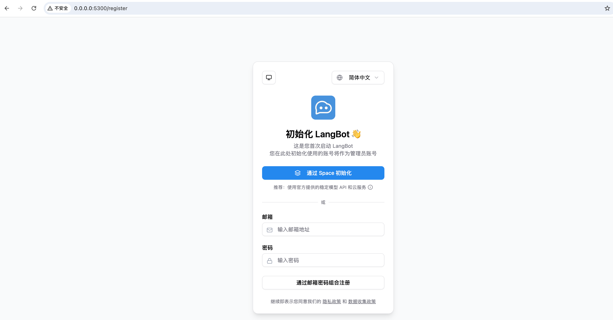

# Mac OS LangBot 本地启动安装 - 本地实操

分使用 Docker Compose 安装和源码手动部署

## Docker Compose 安装（推荐，环境零污染、最简单）

卡顿不成功

## 源码本地手动部署（适合本地开发调试）

工具：Python3.11+、Miniconda3 arm64 虚拟环境

### 1. 创建虚拟环境（如果你用 conda）

```bash
# 创建环境
conda create -n langbot python=3.13
conda activate langbot
```

### 2. 拉取 LangBot 源码

```bash
git clone https://github.com/langbot-app/LangBot.git
cd LangBot
```

### 3. 安装依赖（官方使用 uv 包管理器）

```bash
pip install uv
# 同步全部依赖
uv sync
```

### 4. build 前端资源

⚠️ 注意：
git clone 下载的源码不包含编译后的 WebUI 静态资源！可以单独编译。

```bash
# 进入项目前端目录
cd web
# 安装node依赖（先确保本机安装 Node.js 18+）
npm install
# 打包编译，生成dist静态文件
npm run build
```

编译完成后，项目 web/dist 文件夹就是前端资源。

### 5. 启动（后端）程序

```bash
uv run main.py
```

首次运行自动生成 data/config.yaml 配置文件。

### 6. 访问 http://127.0.0.1:5300

这里会在程序中调用前端静态资源。




