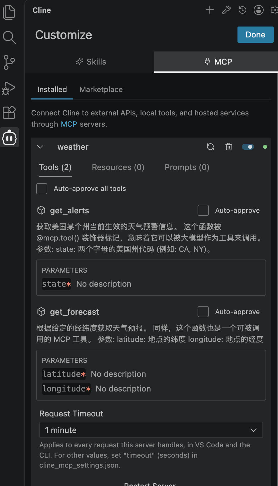
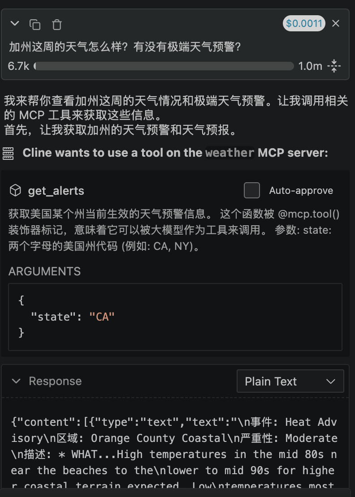

# 开发 MCP Server 端项目

## 切换到当前目录
也可通过 uv init weather 重新创建新的项目。
```bash
cd weather
```

## 创建并激活虚拟环境
```bash
uv venv
source .venv/bin/activate
```

## 安装项目所需的依赖包
```bash
uv add "mcp[cli]" httpx
```

## 创建MCP 服务器代码文件
```bash
touch weather.py
```

# 配置 Host 用户端
需要 host，这里可以选择 VSCode+Cline插件

## 安装 VSCode 和 Cline 插件

## 在 Cline 插件中配置 MCP server 并调用
⚠️注意：command 通过 ”which uv“ 获取的绝对路径
```cline_mcp_settings.json
{
  "mcpServers": {
    "weather": {
      "disabled": false,
      "timeout": 60,
      "type": "stdio",
      "command": "uv",
      "args": [
        "--directory",
        "/Users/用户/WebstormProjects/deepseek-quickstart/mcp/weather",
        "run",
        "weather.py"
      ]
    }
  }
}
```
保存后会自动启动 MCP tools


# 配置 AI Model

# 提问测试
prompt：加州这周的天气怎么样？有没有极端天气预警？



# 开发 MCP Client 端
Cline 默认自带 MCP Client 端


